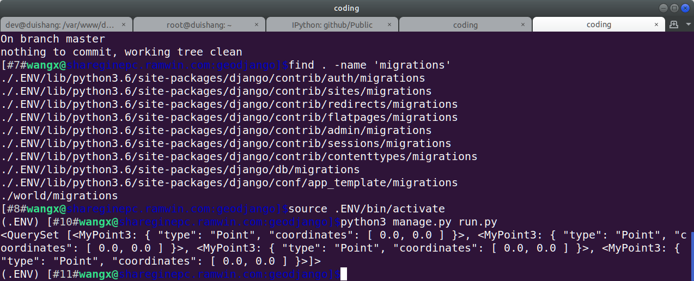
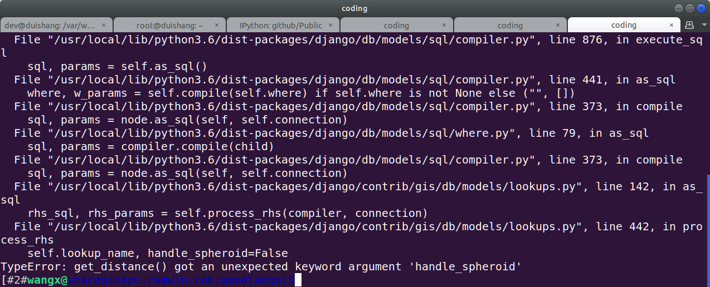

#### Xiang Wang @ 2017-12-18 17:09:02

# run a test
* create a database
* change your database name, user and password in `geodjango/settings.py` line 87 to line 89
* run the following code
```
    rm -rf world/migrations  # run this command if it is your first time to test the code
    python3 manage.py makemigrations
    python3 manage.py migrate
    python3 manage.py run
```


# My Tests
* If I use django 2.0 to run the code, the result will be:

* If I use django 1.11 to run the code, the result will be:


* I'm glad to hear any suggestions from you. My email is [ramwin@qq.com](mailto:ramwin@qq.com)
